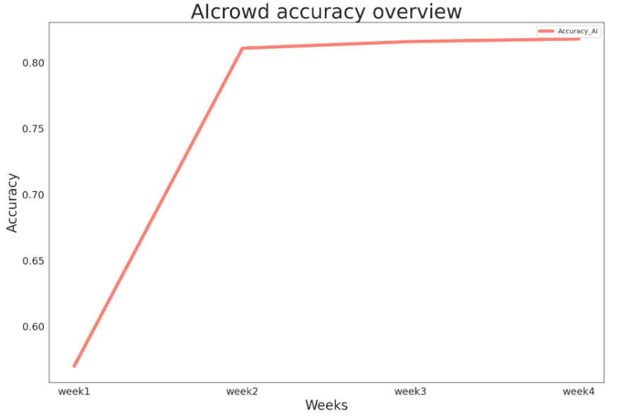

## Group project: Real or Not? NLP with Disaster Tweets


### 🕵️ Project description

Twitter has become a popular social network for many users. However, it is also used to relay fake news.  

The goal of this project is to build a machine learning model that predicts which Tweets are about real disasters and which one’s aren’t.  

To train the model, we have access to a dataset of 6,471 Tweets that were already classified (0 = fake news, 1 = real news). The aim is to use the different techniques seen in class to perform the EDA and the data cleaning in a first step before testing different classifiers to determine which one provides the best accuracy.

### 🛬 Solution

- **Classifier**: Logisitic regression
- **Parameters**: ```C = 3.6, ngram_range = (1,3), norm = 'l1'```
- **Internal accuracy**: 0.823
- **AICrowd accuracy**: 0.818

By analysing the confusion matrix, it turned out that the model was very good at detecting the real news and the optimisation has certainly impacted this prediction of the real news even more.

However, this model is bad at detecting fakes news like most of the other models tested. This means that there are things inherent and unique to fakes news that were not captured by these models. One solution would be to use additional features (feature engineering: lexical categories) that would allow to capture the characteristics of the fakes news.

### ⚙️ Models & Parameters

Note: GridSearch(cv = 5) used for all optimizations

| **Model**                                                | **Parameters**                                                                               |**Internal Accuracy**|
|----------------------------------------------------------|-------------------------------------------------------------------------------------------------------|------------|
| **Logistic regression**                                  |                                                                                                       |            | 
| X = tweet (non-optimized)                                | ```max_iter = 100000```                                                                               | 0.804      |
| X = tweet (hyperparameters optimization)                 | ```C = 3.6, ngram_range = (1,3), norm = 'l1'```                                                       | **0.823**  |
| X = location                                             | ```C = 1```                                                                                           | 0.59       |
| X = lexical categories (all)                             | ```C = 1```                                                                                           | 1          |
| X = lexical categories (reduced)                         | ```C = 2```                                                                                           | 0.676      |
| X = lexical categories (std)                             | ```C = 2```                                                                                           | 0.676      |
| X = lexical categories (std + PCA)                       |                                                                                                       | 0.676      |
| X = keywords                                             | ```C = 1```                                                                                           | 0.59       |
| *Combined features*                                      |                                                                                                       |            |
| X = lexical + location                                   |                                                                                                       | 0.662      |
| X = lexical + keyword                                    |                                                                                                       | 0.654      |
| X = location + keyword                                   |                                                                                                       | 0.579      |
| X = all features                                         |                                                                                                       | 0.654      |
| **KNN**                                                  |                                                                                                       |            |
| X = tweet (non-optimized)                                |                                                                                                       | 0.762      |
| X = tweet (hyperparameters optimization)                 | ```ngram_range = (1,3), norm = 'l2', p = 2, weights = 'distance', n_neighbors = 19, leaf_size = 1```  | **0.779**  |
| X = lexical categories (hyperparameters optimization)    | ```p = 1, weights = 'distance', n_neighbors = 19, leaf_size = 1```                                    | 0.728      |
| **Decision tree**                                        |                                                                                                       |            |
| X = tweet (non-optimized)                                | ```ngram_range = (1,3), norm = 'l2'```                                                                | 0.755      |
| X = tweet (hyperparameters optimization)                 | ```max_depth = 71, min_samples_split = 15```                                                          | **0.762**  |
| **Random forest**                                        |                                                                                                       |            |
| X = tweet (non-optimized)                                | ```ngram_range = (1,3), norm = 'l2'```                                                                | 0.792      |
| X = tweet (hyperparameters optimization)                 | ```criterion = entropy```                                                                             | **0.793**  |
| X = lexical categories (hyperparameters optimization)    | ```bootstrap = true, criterion = gini, 11, n_estimators = 10```                                       | 0.667      |

### 🚀 Progress of the project

#### Week 1

💻 **Github**

- Repo initialisation
- Setting up the repo structure
- Ressources uploaded: training_set, test_set
- Draft README

💾 **Data**

- Import the inital database into the notebook
- Calculate the base rate on the original dataset
- Distribution of the data in the inital database: 3,701 fake news & 2,770 real news
- Train the model on the original dataset without any modification to set the base benchmark accuracy (basic model)

🧹 **Text preprocessing**

- Word cloud of the dataset to determine the type of words contained in the Tweets
- Preproceesing the text to remove irrevelant information 
- Run an elementar model

#### Week 2

📊 **EDA**

- Plot the Top 50 keywords (entire training set, distinction between fake/real news Tweets)
- Plot the Top 50 locations (entire training set, distinction between fake/real news Tweets)
- Plot the most common words and word types in Tweets

#### Week 3

📊 **EDA** + ⚙️ **Optimization**

- EDA completed
- Cleaning the features in progress
- Testing different classifers
- Cross validation to be done

#### Week 4

⚙️ **Optimization**

- Different classifiers tested: Logistic regression, kNNeighbours, Decision Tree, Random Forest
- Hyper-parameter optimization with GridSearch

### 🥇 Results

10 subsmissions on AIcrowd:
- 1<sup>st</sup> submission (basic model): 0.57
- 2<sup>nd</sup> submission (Logistic regression model): 0.811
- 3<sup>rd</sup> submission (Logistic regression optimized model): 0.816
- 4<sup>th</sup> submission (Logistic regression optimized numbers removal model): 0.818




### 📹 Video

To be added later 😁
